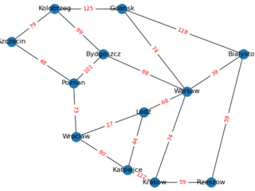

# Telecommunication network design solver
This repository contains the implementation of evolutionary algorithm solving network design problems.

## Usage

```txt
usage: main.py [-h] [--model FILE] [--population-size N] [--epochs N] [--mutation MUTATION] [--multi-mode]

Solve network design problems using genetic algorithm

optional arguments:
  -h, --help            show this help message and exit
  --model FILE, -f FILE
                        Path to file describing network model
  --population-size N, -n N
                        Size of population used by genetic algorithm
  --epochs N, -t N      Number of cycles done before returning result
  --mutation MUTATION   Mutation factor
  --multi-mode          Whether to solve problem assuming that network support packets commutation
```

Example usage:
```bash
./main.py      # Use ./polska.txt model and default genetic alg params
./main.py --model polska.txt -n 123 -t 10000
```

## Example output

| Graph view | Cost function |
| -- | -- |
|  |  |