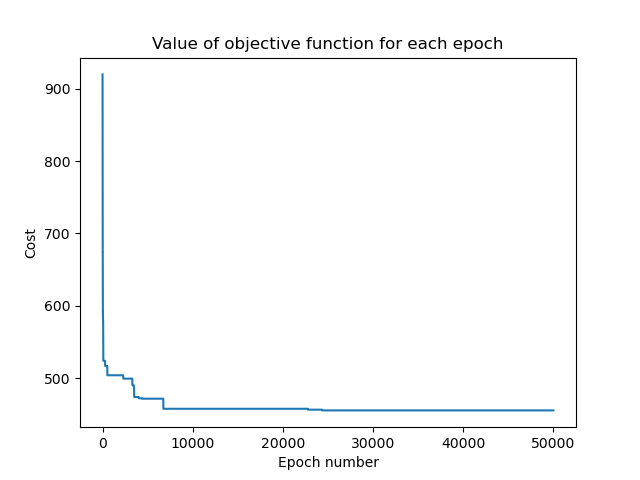

# Telecommunication network design solver
This repository contains the implementation of evolutionary algorithm solving network design problems.
Supports network models from [sndlib](http://sndlib.zib.de) service.

_Project created for Heuristic Algorithms subject at Warsaw University of Technology_

## Prerequisite
Install requirements specified in [`requirements.txt`](./requirements.txt):

```shell
# Using pip
python3 -m pip -r requirements.txt

# Using packet manager (apt)
apt install python-networkx python-matplotlib

# Using packet manager (pacman)
pacman -S python-networkx python-matplotlib
```

Optionally, to use scripts from `tools/` directory install also `xlsxwriter` module.

Additionally, network models from sndlib are required to launch script. Program is known to work on ones listed below:
- [polska--D-B-M-N-C-A-N-N](http://sndlib.zib.de/home.action?show=/problem.details.action%3FproblemName%3Dpolska--D-B-M-N-C-A-N-N%26frameset)
- [germany50--D-B-M-N-C-A-N-N](http://sndlib.zib.de/home.action?show=/problem.details.action%3FproblemName%3Dgermany50--D-B-M-N-C-A-N-N%26frameset)


## Usage
Solver can be started using `main.py` script. Run with `--help` flag to list all available options:

```txt
usage: main.py [-h] [--model FILE] [--population-size N] [--epochs N] [--mutation R] [--xover R]
               [--selection TYPE] [--succession TYPE] [--modularity K] [--multi-mode] [--output DIR]
               [--hide-plots] [--quiet]

Solve network design problems using genetic algorithm

optional arguments:
  -h, --help            show this help message and exit
  --model FILE, -f FILE
                        Path to file describing network model
  --population-size N, -n N
                        Size of population used by genetic algorithm
  --epochs N, -t N      Number of cycles done before returning result
  --mutation R, -m R    Mutation factor
  --xover R, -x R       Crossover chance
  --selection TYPE, -sel TYPE
                        Selection type (rand / exp)
  --succession TYPE, -succ TYPE
                        Succession type (best / tourny)
  --modularity K, -mod K
                        Modularity of links
  --multi-mode          Whether to solve problem assuming that network support packets commutation
  --output DIR          Name of directory to which results will be saved
  --hide-plots          Whether to display plots after final cycle of genetic algorithm
  --quiet, -q           Run without printing anything
```

Example usage:
```bash
./main.py      # Use ./polska.txt model and default genetic alg params
./main.py --model polska.txt -n 123 -t 10000
```

Computed solutions are plotted by `mathplotlib` (unless `--hide-plots` flag is specified) 
and detailed results are saved to output director (`--output` argument, default: `output/`).

Script `tools/outputToXlsx.py` can be used to export results to Excel worksheet with some useful formulas added.

## Example output

| Graph view | Cost function |
| -- | -- |
|  |  |

Command used to acquire the above results:
```bash
./main.py -t 10000 -sel exp -succ tourny -n 40
```

## Testing
Utility `compare.py` can be used to check the algorithm results for different parameters values. 
To view all available options run it with `--help` flag.

```txt
usage: compare.py [-h] [--repeat N] [--epochs N] [--model FILE] [--log FILE]

Compare various configurations of the genetic algorithm

optional arguments:
  -h, --help            show this help message and exit
  --repeat N, -r N      Number of runs for each config
  --epochs N, -t N      Number of cycles done before returning result
  --model FILE, -f FILE
                        Path to file describing network model
  --log FILE, -l FILE   Path to log file
```

What's more, project comes with unit tests of core components, stored in `test` directory. In order to launch tests, simply run:
```bash
python3 -m unittest
```
